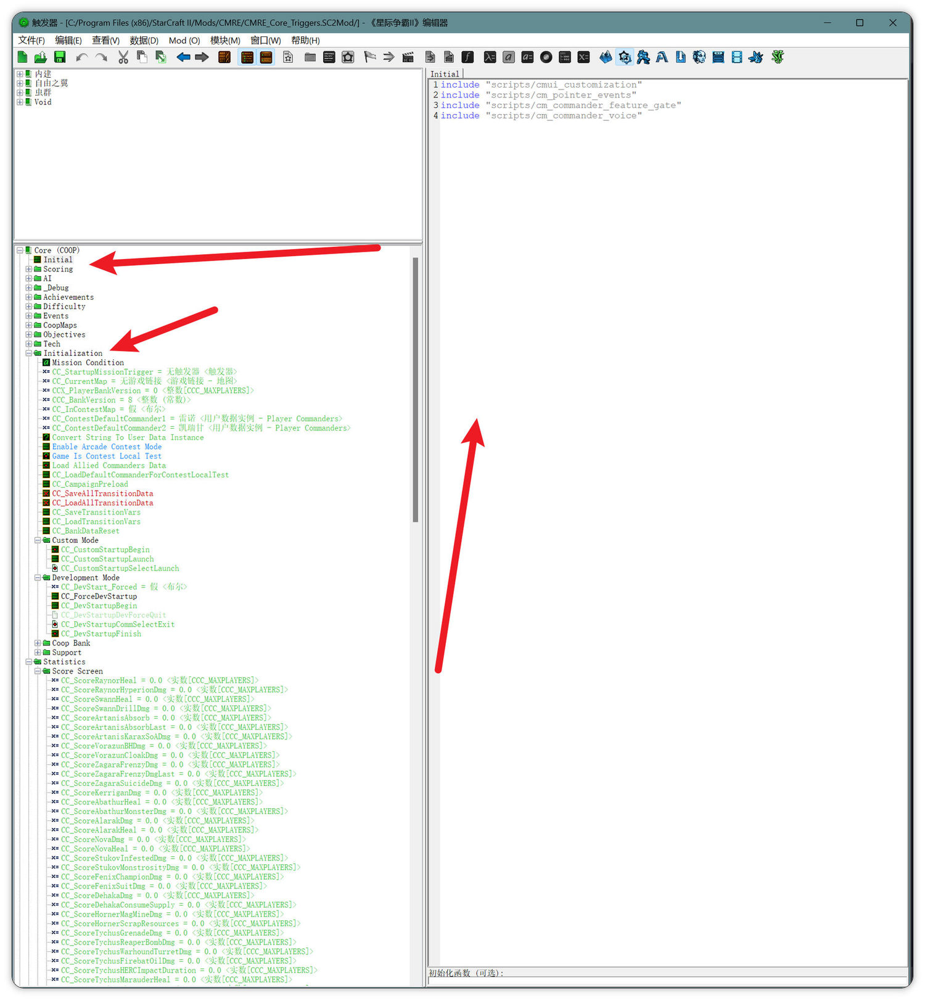
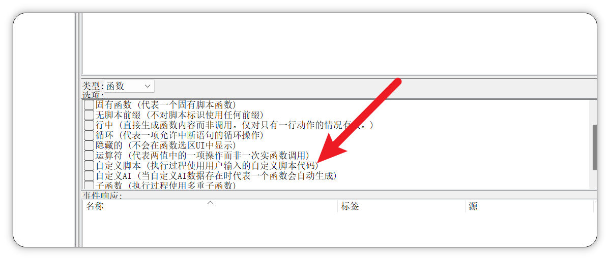
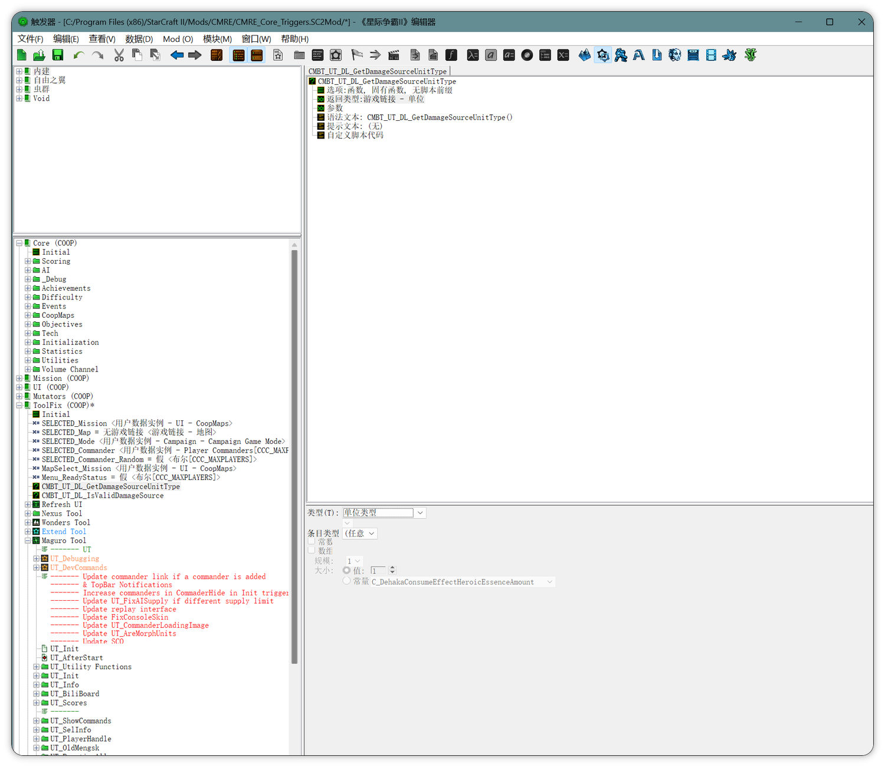
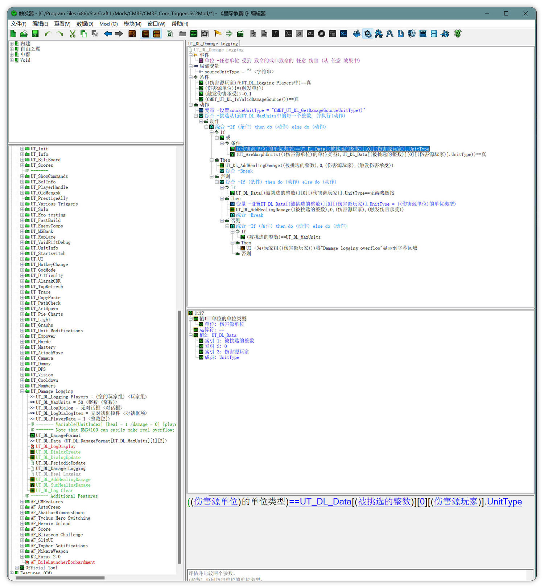

# 编辑器侧改动说明（战斗遥测 3.1a）

> 这份文档只讲一件事：**这次改动除了 `.galaxy` 脚本，还在银河编辑器的触发器树里加/改了哪些元素。**
>
> 为什么单独写：只看 git diff 会以为全是代码改动。实际上有三类元素是在编辑器 UI 里登记的，
> 它们的最终形态才落进生成的 `LibCOTF.galaxy`。**后续维护者要通过编辑器 UI 调整它们，
> 就必须知道它们在树里的哪个位置。** 只改脚本文件、不在树里登记，编辑器一次保存就会把改动清零。

适用版本：`CMRE_Core_Triggers.SC2Mod`，capture schema 3.1a。

---

## 一句话摘要

| 类型 | 数量 | 位置 |
|---|---|---|
| 新增 include | 1 行 | `ToolFix (COOP)` → `Initial`（Custom Script 元素） |
| 新增初始化函数入口 | 1 处 | 同上元素的「初始化函数（可选）」框 |
| 新增 Native 函数元素 | 2 个 | `ToolFix (COOP)` 根下 |
| 改动既有触发器 | 1 个 | `ToolFix (COOP)` → `Maguro Tool` → `UT_Damage Logging` → `UT_DL_Damage Logging` |

新增脚本文件 `Base.SC2Data/scripts/cm_balance_telemetry.galaxy` 是纯脚本，不在树里，正常读 diff 即可。

---

## A. Custom Script「Initial」：加一行 include + 填初始化函数

**树里的位置**：`ToolFix (COOP)` → `Initial`

注意是 **ToolFix (COOP)**，不是 `Core (COOP)`。这两个库各有一个叫 `Initial` 的 Custom Script 元素，
include 列表长得几乎一样，界面上分不出来。库显示名与生成文件的对应关系：

| 编辑器里的库名 | 生成文件 |
|---|---|
| Core (COOP) | `LibCOOC.galaxy` |
| Mission (COOP) | `LibCOMI.galaxy` |
| UI (COOP) | `LibCOUI.galaxy` |
| Mutators (COOP) | `LibCOMU.galaxy` |
| **ToolFix (COOP)** | **`LibCOTF.galaxy`** |
| Features (CM) | `LibCMFE.galaxy` |

**改了什么**：

- include 列表末尾追加一行 `include "scripts/cm_balance_telemetry"`
- 元素底部的「初始化函数（可选）」框填入 `CMBT_Init`（只填函数名，不带括号）

下图是这个元素的样子（截图取自 `Core (COOP)`，`ToolFix (COOP)` 的界面完全一样）。
左下是触发器树，右上是 include 列表，右下角就是「初始化函数（可选）」输入框：



**为什么初始化要走这个框**：编辑器会把它生成成 `libCOTF_InitCustomScript()` 里的一次调用，
而 `InitCustomScript()` 在 `InitTriggers()` **之前**执行，遥测的事件订阅必须早于触发器初始化。

---

## B. 两个 Native 函数元素

**树里的位置**：`ToolFix (COOP)` 根下（与 `SELECTED_*` 那些变量并列）

- `CMBT_UT_DL_IsValidDamageSource`
- `CMBT_UT_DL_GetDamageSourceUnitType`

这两个元素**不含任何实现**——实现在 `cm_balance_telemetry.galaxy` 里。
它们存在的唯一目的，是让 GUI 触发器能在条件/动作里调用脚本函数。

**关键：属性里必须勾两个选项。** 在函数元素上右键属性 → 双击「选项:函数」打开下图这个对话框：



必须勾的是**最上面两个**：

- **固有函数（代表一个固有脚本函数）** — 让编辑器只生成调用、不生成函数体
- **无脚本前缀（不对脚本标识使用任何前缀）** — 缺这个会生成 `libCOTF_gf_CMBT_...()`，对不上脚本里的真实函数名

图里箭头指的「自定义脚本」是**错的**，别勾它。

配好之后属性行应该显示 `选项: 函数, 固有函数, 无脚本前缀`，语法文本是光秃秃的 `CMBT_UT_DL_GetDamageSourceUnitType()`。
两个勾对应 `Triggers` XML 里的 `<FlagNative/>` 与 `<FlagNoScriptPrefix/>`，
可以不开编辑器直接核对（做法见文末「怎么确认」第 2 节）。
下图是配置完成后的样子，同时可以看到这两个元素在树里的确切位置：



**返回类型要注意**：`CMBT_UT_DL_GetDamageSourceUnitType` 的返回类型是 **「游戏链接 - 单位」**，
不是「字符串」。两者在 Galaxy 层都生成 `string`，但编辑器的类型系统把它们当两种类型——
标成字符串会导致后面 C 节的成员选择器失效。

---

## C. 改动既有触发器 `UT_DL_Damage Logging`

**树里的位置**：`ToolFix (COOP)` → `Maguro Tool` → `UT_Damage Logging` → `UT_DL_Damage Logging`

> 编辑器里查找这个触发器时，**显示名是 `UT_DL_Damage Logging`，Damage 和 Logging 中间有空格**
> （生成的标识符才是 `UT_DL_DamageLogging`）。搜 `DamageLogging` 找不到，搜 `UT_DL_` 才行。

这是**上游既有的托管触发器**，我们在它里面做了四处改动：

| # | 位置 | 改动 |
|---|---|---|
| 1 | 局部变量 | 新增 `sourceUnitType`，类型 **游戏链接 - 单位** |
| 2 | 条件 | 新增第 4 条 `(CMBT_UT_DL_IsValidDamageSource()) == 真` |
| 3 | 动作（首条） | 新增 `设置 sourceUnitType = CMBT_UT_DL_GetDamageSourceUnitType()` |
| 4 | 动作（循环内 3 处） | 把 `(伤害源单位)的单位类型` 换成 `sourceUnitType` |

下图是改动过程中的截图，可以看到这四处的确切位置（局部变量、第 4 条条件、动作首行、以及循环里那三处引用）：



> 图中动作首行显示的是 `"CMBT_UT_DL_GetDamageSourceUnitType()"`（**带引号**），
> 那是操作过程中的错误中间态——函数名被当成字符串字面量填进去了。
> 正确做法是在值编辑器里把「源」选成 **函数(F)**、从列表里挑，而不是手打进文本框。
> 配对后不应该有引号。

**这四处是一个整体，不能只做一半。** 原因：

- 上游原条件是 `伤害源单位 != null`，诺娃「格里芬空袭」的伤害结算时来源单位已经消失，
  所以这类伤害从来没被记账过（老 bug）。
- 改动 2 放宽了这个条件；改动 3/4 负责在来源为 null 时给出替代的单位类型名。
- **只放宽条件、不换取值方式，循环里就会对 null 调 `UnitGetType`** ——这正是崩溃的成因。

---

## 怎么确认这些元素真的进树了（不用开编辑器）

编辑器的真相源是 `CMRE_Core_Triggers.SC2Mod/Triggers`——**它是一份 XML**（约 62 MB），
`Lib*.galaxy` 只是从它生成出来的产物。既然是 XML，就可以直接读，判据分两种。

### 1. Custom Script 元素（include 与初始化入口）

这类内容以原文存在 XML 里，直接搜模块名即可：

```bash
cd Mods/CMRE/CMRE_Core_Triggers.SC2Mod
grep -n -A3 'cm_balance_telemetry' Triggers
```

期望看到（`&quot;` 是 XML 转义的双引号）：

```xml
                include &quot;scripts/cm_balance_telemetry&quot;
            </ScriptCode>
            <InitFunc>CMBT_Init</InitFunc>
```

搜不到 = 没进树，编辑器下次保存就会把它抹掉。

### 2. 函数、触发器、变量等元素

**这类元素的名字不在 `Triggers` 里**——XML 里只有 8 位十六进制 id，
显示名单独存在各语言的 `TriggerStrings.txt`。所以要分两步：

```bash
# 第一步：从 TriggerStrings 拿到 id
grep 'CMBT' zhCN.SC2Data/LocalizedData/TriggerStrings.txt
#   FunctionDef/Name/lib_COTF_BCC4C17E=CMBT_UT_DL_GetDamageSourceUnitType
#   FunctionDef/Name/lib_COTF_EB35018D=CMBT_UT_DL_IsValidDamageSource
#                    ^^^^^^^^ 库前缀     ^^^^^^^^ 元素 id

# 第二步：用 id 在 Triggers 里读元素定义
grep -A10 '<Element Type="FunctionDef" Id="BCC4C17E">' Triggers
```

期望看到：

```xml
<Element Type="FunctionDef" Id="BCC4C17E">
    <FlagCall/>
    <FlagNative/>             <!-- 固有函数：勾上了 -->
    <FlagNoScriptPrefix/>     <!-- 无脚本前缀：勾上了 -->
    <ReturnType>
        <Type Value="gamelink"/>
        <GameType Value="Unit"/>   <!-- 返回类型 = 游戏链接-单位 -->
    </ReturnType>
</Element>
```

**这一步能直接验 B 节那两个勾有没有打上，不用开编辑器。**
缺 `<FlagNative/>` 或 `<FlagNoScriptPrefix/>`，生成的调用就会带 `libCOTF_gf_` 前缀、对不上脚本函数。

### 3. 一条旁证

如果 `Triggers` 的修改时间**早于** `LibCOTF.galaxy`，说明有人手写过生成产物，
那些内容多半没进树。

---

## 给后续维护者

- 要改遥测的**逻辑**：直接改 `scripts/cm_balance_telemetry.galaxy`，不需要开编辑器，
  游戏加载 mod 时会编译。
- 要改**接线方式**（换 include、换初始化入口、给 GUI 触发器加新的脚本调用）：必须开编辑器，
  按上面 A/B/C 的位置操作，保存后跑一次 `grep -ac` 确认。
- **不要直接编辑 `LibCOTF.galaxy`**。它是生成产物，手改的内容在下一次编辑器保存时会静默消失，
  没有任何报错。这次改动之前，遥测的接线代码就是以手写形式在这个文件里存在了六天——
  文件里看得见、游戏里跑得通，但 `Triggers` 里查无此物。
- 编辑器保存有几个已知副作用，属于正常噪声：匿名局部变量会被重新随机命名、
  `ComponentList.SC2Components` 的 `<Optimized/>` 标记可能被移除、
  `TriggerStrings.txt` 等文件随动。建议保存前对整个 mod 目录做一次文件哈希快照，保存后逐一对账。
